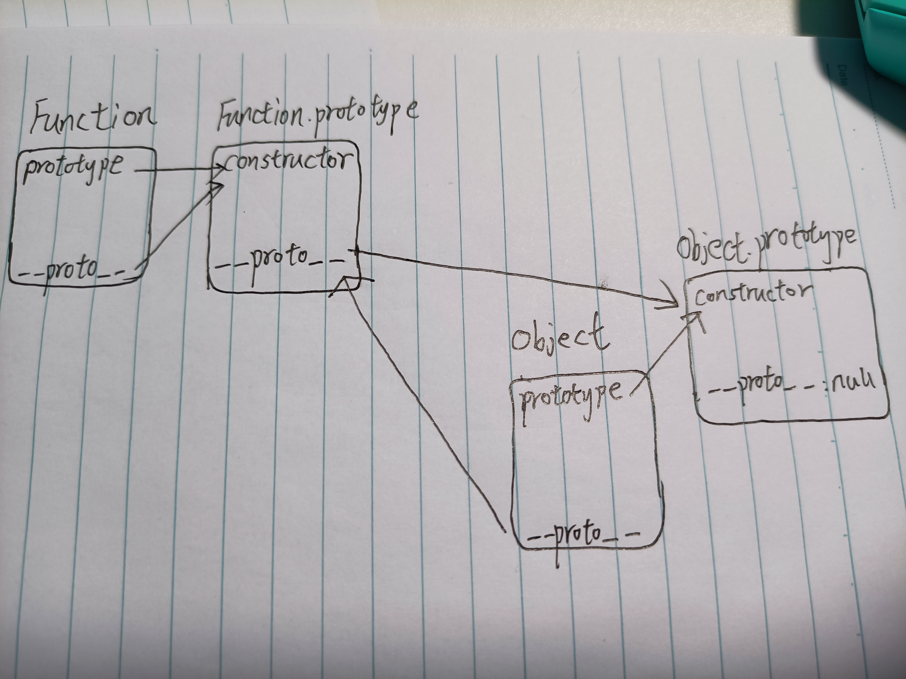
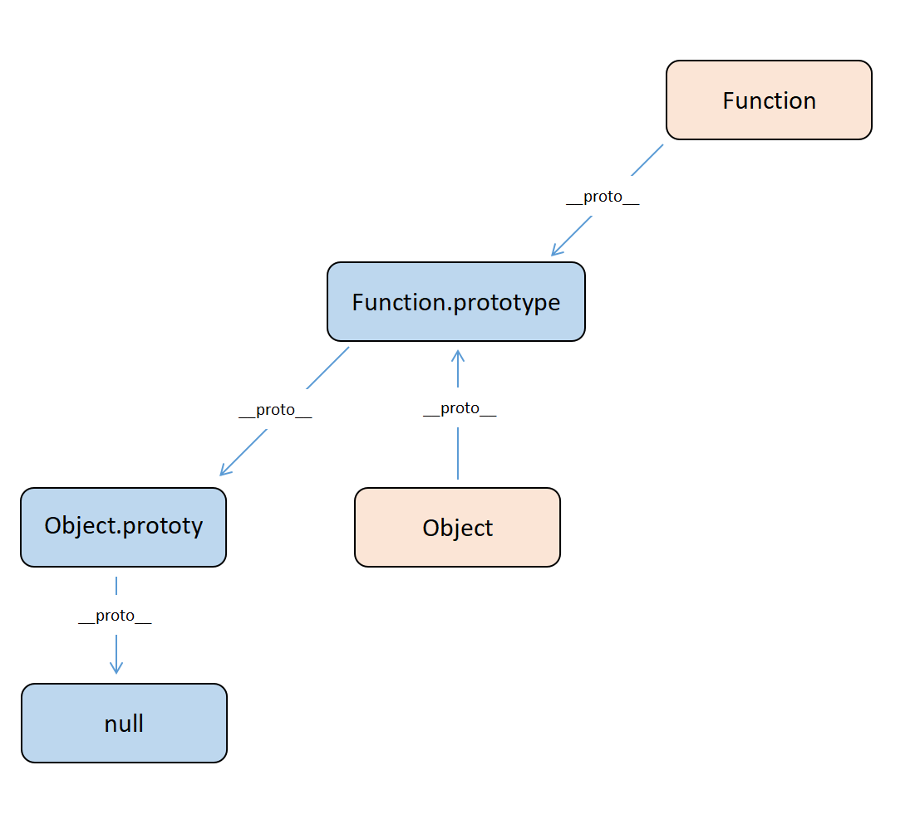
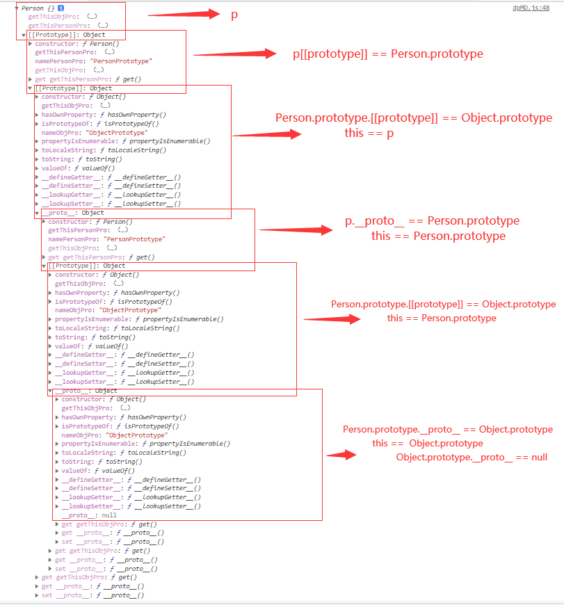
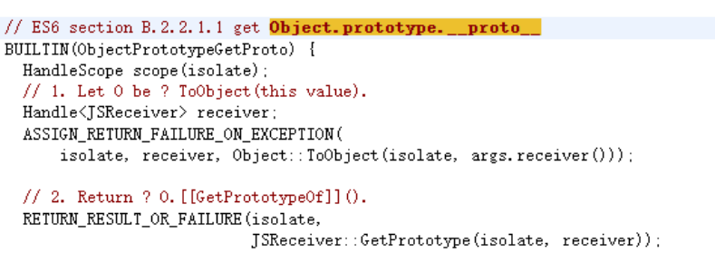

# JavaScript：原型、原型链

## 几个重要知识点

所有的`函数`都天生自带一个属性：prototype（原型）, 它是一个对象数据类型的值，在当前prototype对象中，存储了类需要给其实例使用的公有的属性和方法

prototype这个对象，浏览器会默认为其开一个堆内存，在堆内存中天生自带一个属性：constructor（构造函数），这个属性存储的值就是当前函数本身

每一个`类的实例`（每一个`对象`）都天生自带一个属性：__proto__，属性值是当前对象所属类的原型（prototype）

```javascript
Function.__proto__ === Function.prototype //true
```

```javascript
Function.prototype.__proto__=== Object.prototype //true
```

```javascript
Object.prototype.__proto__ === null //true
```

```javascript
Object.__proto__ === Function.prototype //true
```





所有的函数（类）都可以调用Function.prototype上的方法

所有的对象（函数也是对象）都可以调用Object.prototype的方法

## prototype：ECMAScript 2022

> object that provides shared properties for other objects

在规范中，prototype：给其他对象提供共享属性的对象

本质上，prototype自己也是一个对象，只是被用来承担给其他对象提供共享属性的职能罢了

实际上给定所有对象，我们当然也可以根据自己的需要，然后给与不同的称谓来做不同的事

比如实现 pubsub pattern 订阅/发布模式时，我们将某个对象称之为 subscriber 订阅者，另一个对象 publisher 称之为发布者

同理，当某个对象，承担了其为其它对象提供共享属性的职责时，它就成为了该对象的 prototype

换句话说，当我们说 prototype 对象时，是在做一个简略描述，实际上说的是“xxx 对象的 prototype对象” 如果不跟其他对象产生关联，就不构成 prototype 这个称谓

因此 prototype 描述的是两个对象之间的某种关系（其中一个吗，为另一个提供属性访问权限）

所有对象，都可以作为另一个对象的 prototype 来用

### 那么一个对象如何为另一个对象提供属性访问呢？

> Every object has an implicit reference (called the object's prototype)

规范中明确描述了所有对象，都有一个隐式引用，它被称之为这个 Object's prototype

在控制台我们可以发现对象有 __proto__ 属性，这意味着 obj 被隐式地挂载了另一个对象的引用，置于 __proto__ 属性中（并非由开发者创建/操作）

## constructor

constructor 属性也是对象所独有的，它是一个对象指向一个函数（实例的构造函数）

单从 constructor 这个属性来讲，只有 prototype 对象才有，每个函数在创建的时候，JavaScript 会同时创建一个该函数对应的 prototype 对象，prototype 对象的 constructor 属性存储函数本身，通过该函数创建的对象可以通过 __proto__ 找到对应的 constructor，任何对象最终都可以找到其对应的构造函数

唯一特殊的就是我们上面最重要的几个知识点中的 Function：它是它自己的构造函数

```javascript
Function.__proto__ === Function.prototype //true
```

JavaScript 中有内置构造器/对象共计12个（ES5中新加了JSON）

```javascript
Number.__proto__ === Function.prototype  // true
Number.constructor == Function //true

Boolean.__proto__ === Function.prototype // true
Boolean.constructor == Function //true

String.__proto__ === Function.prototype  // true
String.constructor == Function //true

Array.__proto__ === Function.prototype   // true
Array.constructor == Function //true

RegExp.__proto__ === Function.prototype  // true
RegExp.constructor == Function //true

Error.__proto__ === Function.prototype   // true
Error.constructor == Function //true

Date.__proto__ === Function.prototype    // true
Date.constructor == Function //true

// 所有的构造器都来自于Function.prototype，甚至包括根构造器Object及Function自身
Object.__proto__ === Function.prototype  // true
Object.constructor == Function // true

// 所有的构造器都来自于Function.prototype，甚至包括根构造器Object及Function自身
Function.__proto__ === Function.prototype // true
Function.constructor == Function //true

Math.__proto__ === Object.prototype  // true
Math.construrctor == Object // true

JSON.__proto__ === Object.prototype  // true
JSON.construrctor == Object //true

// Arguments Global
```

### 问题：Symbol 是构造函数么？

MDN：
> The Symbol() function returns a value of type symbol, has static properties that expose several members of built-in objects, has static methods that expose the global symbol registry, and resembles a built-in object class but is incomplete as a constructor because it does not support the syntax "new Symbol()"

Symbol 是基本数据类型，但作为构造函数来说它并不完整，因为它不支持语法 new Symbol()，Chrome 认为其不是构造函数，如果要生成实例直接使用 Symbol() 即可

虽然是基本数据类型，但 Symbol(123) 实例可以获取 constructor 属性值

```javascript
new Symbol(123)  // Symbol is not a constructor 
```

```javascript
var sym = Symbol(123)
console.log(sym)    // Symbol(123)
console.log(sym.constructor)    // ƒ Symbol() { [native code] }
```

这个 constructor 属性来自哪里？其实是 Symbol 原型上得，即 Symbol.prototype.constructor 返回创建实例原型得函数，默认为 Symbol 函数

### new

## __proto__

__proto__ 的例子，说起来比较复杂，可以说是一个历史问题

ECMAScript 规范描述 prototype 是一个隐式引用，但之前的一些浏览器，已经私自实现了 __proto__ 这个属性，使得可以通过 obj.__proto__ 这个显式的属性访问，访问到被定义为隐式属性的 prototype

因此，情况是这样的，ECMAScript 规范说 prototype 应当是一个隐式引用:

> 1. 通过 Object.getPrototypeOf(obj) 间接访问指定对象的 prototype 对象
> 2. 通过 Object.setPrototypeOf(obj, anotherObj) 间接设置指定对象的 prototype 对象
> 3. 部分浏览器提前开了 __proto__ 的口子，使得可以通过 obj.__proto__ 直接访问原型，通过 obj.__proto__ = anotherObj 直接设置原型
> 4. ECMAScript 2015 规范只好向事实低头，将 __proto__ 属性纳入了规范的一部分

我们正常的对象里存在一个 __proto__ 属性。实际上，它只是开发者工具为了方便让开发者查看原型，故意渲染出来的虚拟节点。虽然跟对象的其它属性并列，但并不在该对象中

_proto__ 属性既不能被 for in 遍历出来，也不能被 Object.keys(obj) 查找出来

访问对象的 obj.__proto__ 属性，默认走的是 Object.prototype 对象上 __proto__ 属性的 get/set 方法

```javascript
    Object.defineProperty(Object.prototype, "__proto__", {
        get() {
            console.log('get')
        }
    })
    console.log(({}).__proto__) // "get" undefined
```

通过覆盖 Object.prototype.__proto__ 我们可以发现，访问普通对象的 __proto__ 触发了 Object.prototype 上的 __proto__ 的 get 方法

### 浏览器控制台中的一个问题

```javascript
function abc() {

}

// 函数原型

// abc.prototype.__proto__ == Object.prototype

// Object.prototype.__proto__ == abc.prototype.__proto__.__proto__ == null

// 函数对象

// abc.__proto__ == Function.prototype 

// Function.prototype.__proto__ == Object.prototype

// Object.prototype.__proto__ == abc.__proto__.__proto__ == null
```

实际上在`控制台Devtools`中 函数原型第一个`Object.prototype.__proto__并不是null` 第一个`Object.prototype.__proto__`也不是null 而是调用了`getter` 即Devtools中显示为`__proto__:（…）` 点击`（…）`调用的是`getter`

### __proto__的getter

```javascript
function Person() { }
let p

//Person的原型上增加 namePersonPro属性和值
Object.defineProperty(Person.prototype, 'namePersonPro', { value: 'PersonPrototype' })
//Person的原型上增加 getThisPersonPro属性，值为get()函数，函数用来获取this
Object.defineProperty(Person.prototype, 'getThisPersonPro', {
    get() {
        console.log('this', this)
        console.log('this is p', this === p)
        console.log('this is Person.prototype', this === Person.prototype)
        console.log('this is Object.prototype', this === Object.prototype)
    }
})

//Object的原型上增加 nameObjPro属性和值
Object.defineProperty(Object.prototype, 'nameObjPro', {
    value: 'ObjectPrototype'
})
//Object的原型上增加 getThisObjPro属性，值为get()函数，函数用来获取this
Object.defineProperty(Object.prototype, 'getThisObjPro', {
    get() {
        console.log('this', this)
        console.log('this is p', this === p)
        console.log('this is Person.prototype', this === Person.prototype)
        console.log('this is Object.prototype', this === Object.prototype)
    }
})

// 创建类Person的实例p
p = new Person()

console.log(p.__proto__)

console.log(p)
```

```text
console.log(p.__proto__)
// p.__proto__ == Person.prototype
// 点击Person.prototype内的getThisPersonPro调用get函数获取的this为Person.prototype
// 进如Person.prototype.__proto__ == Object.prototype 有 nameObjPro:"ObjectPrototype"
// 理论上继续进点击 Object.prototype.__proto__ == null 
// 实际上 进如Person.prototype.__proto__（Object.prototype） 后
// 点击 getThisObjPro 调用get函数获取的this依然为Person.prototype
// 所以点击 __proto__:(...) 调用get函数获取的this依然是Person.prototype
// 所以展开结果是 Person.prototype.__proto__ == Object.prototype 跟上次一样 有 nameObjPro:"ObjectPrototype"
// 此时第二次进入 Object.prototype 后我们继续点击 getThisObjPro：（…） 发现get函数返回的this变成了Object.prototype
// 所以此时我们 点击 __proto__:(...)  获取的即 Object.prototype.__proto__ == null

console.log(p)
// 点击 getThisObjPro / getThisPersonPro 调用get函数 此时获取的this为p
// 点击 p.[[Prototype]]进入p.__proto__(Person.prototype) 有 namePersonPro: "PersonPrototype" (第一次)
// 点击 getThisPersonPro / getThisObjPro 调用get函数 此时获取的this为p
// 点击 在Person.prototype 内 Person.prototype.__proto_ 进入 Object.prototype  有 nameObjPro: "ObjectPrototype" (第一次)
// 理论上 这时候 Object.prototype.__proto__ == null  
// 实际点击 getThisObjPro 调用get函数 此时获取的this为p 点击proto调取get函数后 进入p.__proto__
// 即进入p.__proto__ 即 Person.prototype 有 namePersonPro: "PersonPrototype" (第二次)
// 点击 getThisPersonPro / getThisObjPro 调用get函数 此时获取的this为Person.prototype
// 点击 Person.prototype.__proto__ 进入 Object.prototype 有 nameObjPro: "ObjectPrototype" (第二次)
// 此时点击 getThisObjPro 获取到的 this 是 Person.prototype
// 所以我们点击 __proto__ 重新进入 Person.prototype.__proto__ 即 Object.prototype 有 nameObjPro: "ObjectPrototype" (第三次)
// 此时我们点击 getThisObjPro 获取到的 this 变为 Object.prototype 所以这次 __proto__ == null
```





## prototype chain

__proto__ 是对象独有，并且指向指向另外一个对象，即它的原型对象 prototype，我们也可以理解为父类对象，当我们访问一个对象属性的时候，在该对象内部进行属性的查找，如果内部不存在这个对象，那么就通过 __proto__ 所指向的原型对象（父类对象）上去找，如果依然查找不到这个属性，那么就继续通过 __proto__ 向上查找，直到查找到 Object.prototype 为止（null）而这个过程也就构成了我们常说的原型链，从某一方面来说就是一个查找机制

## 原型重定向

```javascript
    function fn(name, age) {
        this.name = name
        this.age = age
    }

    fn.prototype.cc = function () {
        console.log('cc')
    }

    fn.prototype = {
        //让原型指向自己开辟的堆内存有一个问题：自己开辟的堆内存中没有constructor这个属性，所以实例在调取constructor的时候找到的是Object，这样不好，此时我们应该重新设置一下constructor，保证机制的完整性
        constructor: fn,
        aa: function () { },
        bb: function () { }
    }

    var f = new fn('xxx', 28)
    //当原型重定向后，浏览器默认开辟的那个原型堆内存会被释放掉，如果之前已经存储了一些方法或者属性，这些东西都会丢失（所以：内置类的原型不允许重定向到自己开辟的堆内存）
```

## 函数的三种角色

三种角色之间没有直接的关系

1. 普通函数
2. 普通对象
3. 类（构造函数）

```javascript
    var fn = function () {
        console.log('fn')
    }
    fn.time = '01点44分'
    fn.date = '0630'
    var objfn = new fn()

    console.log(fn)
    // ƒ () {
    //     console.log('ƒn')
    // }
    console.log(objfn)
    // ƒn {}
    console.dir(fn)
    // ƒ ƒn()
    //     date:"0630"
    //     time:"01点44分"
    //     arguments:null
    //     caller:null
    //     length:0
    //     name:"fn"
    //     prototype:{constructor:ƒ}
```
