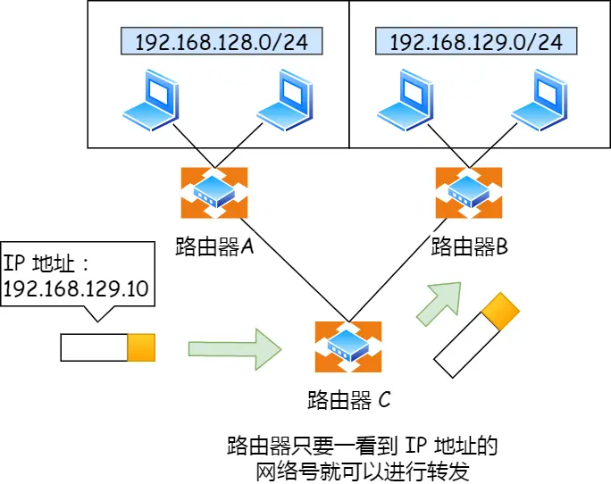

# 1.0 键入网址到网页显示，期间发生了什么？


## URL解析  

> 首先浏览器做的第一步工作就是要对 URL 进行解析，从而生成发送给 Web 服务器的请求信息。

<https://www.baidu.com/>  
<https://item.jd.com/100038005193.html>  
<https://detail.tmall.com/item.htm?de_count=1&id=709064714885&skuId=5148947539712>

一个完整的 URL 分为几个部分


- 协议
  - `HTTP(80)`：超文本传输协议
  - `HTTPS(443)`：基于SSL（Secure Sockets Layer 安全套接层）加密的HTTP传输协议，比HTTP更加安全（涉及支付的网站一般都是基于HTTPS完成的）
  - `FTP(21)`：文件传输协议，一般用来实现资源文件在服务器上的上传下载
- 域名(服务器)
- 端口
  - 用来区分同一台服务器上不同服务的标识（基于WEB服务管理器创建服务的时候可以指定）不同服务之间一般是不能使用相同的端口号的
  - ​如果当前网站服务，采用的是协议对应的默认端口管理，那么当用户输入网址的时候可以不指定端口号，浏览器会默认把用户把默认的端口传递给服务器
  - 一台服务器上的端口号范围：0~65535之间，1023及以下的端口已经分配给了常用的一些应用程序做保留
- 路径
  - `/stu/index.html`：一般都是请求当前服务对应的项目目录中，STU文件夹中的INDEX.HTML页面。但是也有特情况，就是当前的URL是被“伪URL重写”的，我们看到的URL请求其实不是真实的请求（例如 `https://item.jd.com/4679424.html` 这个URL就是被重写的，它的真实URL地址很可能是 `https://item.jd.com/detail.jsp?id=4679424`，其实就是跳转到详情页，通过问号传递不同的产品编号，展示不同的产品详情信息，但是.jsp这种服务器渲染的动态页面不能被搜索引擎收录，不利于页面的SEO，所以我们会把动态页面静态化，这也就用到了URL重写技术）
  - `/stu/info`：这种没有任何后缀信息，一般都不是用来请求资源文件的，而是用于AJAX数据请求的接口地址（如果后缀是.json类的，也是同理），但是有一种除外 /stu/info/ 这种的很可能不是接口地址，而是没有指定请求的资源名称，服务器会请求默认的资源文件，一般都是index.html/default.html...
  - `DHTML`：动态页面，泛指当前页面中的内容不是写死的而是动态绑定的，例如.jsp/.php/.aspx...这些页面中的数据都是基于AJAX或者是后台编程语言处理，由服务器端渲染，最后把渲染后的结果返回给客户端呈现的
- 参数
  - 问号传参及哈希值`[?xxx=xxx&...\#xxx]` `[?name=xxx&age=25#teacher]`
  - 在HTTP事务中，问号传参是客户端把信息传递给服务器的一种方式(也有可能是跳转到某一个页面，把参数值传递给页面用来标识的)
  - 哈希值一般都跟客户端服务器交互没啥关系，主要用于页面中的锚点定位和HASH路由切换

## HTTP请求阶段：向服务器发送请求

### DNS域名解析

> 通过浏览器解析 URL 并生成 HTTP 消息后，需要将消息发送给 Web 服务器。

但在发送之前，还有一项工作需要完成，那就是查询服务器域名对应的 IP 地址

有一种服务器就专门保存了 Web 服务器域名与 IP 的对应关系，它就是 DNS 服务器

> 域名的层级关系  

DNS 中的域名都是用句点来分隔的，比如`www.baidu.com`这里的句点代表了不同层次之间的界限。

在域名中，越靠右的位置表示其层级越高。实际上域名最后还有一个点，比如`www.baidu.com.`
这个最后的一个点代表根域名。

根域的 DNS 服务器信息保存在互联网中所有的 DNS 服务器中

也就是，. 根域是在最顶层，它的下一层就是 .com 顶级域，再下面是 baidu.com。

所以域名的层级关系类似一个树状结构：


> 域名解析的工作流程  

- 缓存查询(浏览器缓存、操作系统缓存、hosts文件、路由器DNS缓存)
- 本地DNS服务器（也就是客户端的 TCP/IP 设置中填写的 DNS 服务器地址）
- 当本地DNS服务器接到客户端请求时，首先在该服务器管理的区域的记录中查找，如果找到该记录，则利用此记录进行解析；如果没有区域信息可以满足查询要求，服务器在本地的缓存中查找
- 如果本地DNS服务器不能在本地找到客户端查询的信息，本地DNS服务器将请求发送到根域名DNS服务器(根域名服务器是最高层次的，它不直接用于域名解析)
- 根域名服务器负责解析客户端请求的根域部分，它将包含下一级域名信息的DNS服务器地址返回给客户端的DNS服务器
- 客户端的DNS服务器利用根域名服务器返回的地址访问下一级DNS服务器，得到再下一级域的DNS服务器
- 按照上述递归方法逐级接近查询目标，最后在有目标域名的DNS服务器上找到相应IP地址信息
- 客户端的本地DNS服务器将递归查询结果返回客户端
- 客户端利用从本地DNS服务器查询得到的IP访问目标主机，客户端和目标建立链接（首先访问的是服务器的web站点管理工具：准确来说是我们先基于工具在服务器上创建很多服务，当有客户端访问的时候，服务器会匹配出具体是请求哪个服务）
- 通过URL地址中携带的端口号，找到服务器上对应的服务，以及服务所管理的项目源文件


### 网络模型  

> 通过DNS解析获取到IP后，就可以把传输工作交给系统中的协议栈

协议栈分为几个部分，我们要在这提一下网络模型


我们以TCP/IP五层模型为例来看一下各个部分的内容

#### 应用层  

我们能直接接触到的就是应用层，当两个不同设备的应用需要通信的时候，应用就把应用数据传给下一层，也就是传输层

应用层是工作在操作系统中的 ***用户态***  传输层及以下则工作在 ***内核态***  

> 应用层协议：TFTP，FTP，HTTP，SNMP，SMTP，DNS，RIP，Telnet  

#### 传输层  

应用层的数据包会传输给传输层，传输层为应用层提供网络支持，提供端对端的接口

> 传输层协议：TCP，UDP  
>
> TCP：传输控制协议Transmission Control Protocol，大部分应用使用的正是TCP传输协议，比如HTTP应用层协议.TCP相比UDP多了很多特性，比如流量控制、超时重传、拥塞控制，这些都是为了保证数据包能可靠的传送给对方。
>
> UDP：UDP相对来说就简单很多，简单到只负责发送数据包，不保证数据包能否抵达对方，但它实时性相对更好，传输效率也高.当然UDP也可以实现可靠传输，把TCP的特性在应用层上实现就可以。
>
> 应用需要传输的数据可能很大，如果直接传输就不好控制，因此当传输层的数据包大小超过`MSS(Maximum Segment Size)`(最大报文段长度)，就要将数据包分块，这样即使中途有一个包丢失或损坏了，只需要重发这一个分块.在TCP协议中，我们把每个分块成为一个`TCP段`。  
>
> 当设备作为接收方时，传输层则要负责把数据包传给应用，但是一台设备上可能会有很多应用在接收或者传输数据，因此需要用一个编号将应用区分开来，这个编号就是端口。
>
> 比如 80 端口通常是 Web 服务器用的，22 端口通常是远程登录服务器用的。而对于浏览器（客户端）中的每个标签栏都是一个独立的进程，操作系统会为这些进程分配临时的端口号。
>
> 由于传输层的报文中会携带端口号，因此接收方可以识别出该报文是发送给哪个应用。

#### 网络层：为数据包选择路由  

> 网络层协议：IP，IPv6，SLIP，ICMP，IGMP，ARP，RARP

传输层可能大家刚接触的时候，会认为它负责将数据从一个设备传输到另一个设备，事实上它并不负责。

实际场景中的网络环节是错综复杂的，中间有各种各样的线路和分叉路口，如果一个设备的数据要传输给另一个设备，就需要在各种各样的路径和节点进行选择，而传输层的设计理念是简单、高效、专注，如果传输层还负责这一块功能就有点违背设计原则了。

也就是说，我们不希望传输层协议处理太多的事情，只需要服务好应用即可，让其作为应用间数据传输的媒介，帮助实现应用到应用的通信，而实际的传输功能就交给下一层，也就是网络层（Internet Layer）。

> 网络层最常用的协议是IP协议，IP协议会将传输层的报文作为数据部分再加上IP包头组装成IP报文,如果报文大小超过MTU(以太网中一般为1500字节)就会再次进行分片,得到一个即将发送到网络的IP报文。


网络接口层的传输单位是帧（frame），IP 层的传输单位是包（packet），TCP 层的传输单位是段（segment），HTTP 的传输单位则是消息或报文（message）。但这些名词并没有什么本质的区分，可以统称为数据包。


网络层负责将数据从一个设备传输到另外一个设备.设备之前区分`IP地址`

对于IPv4协议,IP地址共32位四段,每段8位 `192.168.0.1`.只有一个IP地址虽然区分了设备但是寻址起来特别麻烦,因此:将IP地址分为两种意义:

- `网络号`:负责标识IP地址属于那个子网
- `主机号`:负责标识同一子网下的不同主机

这需要配合`子网掩码`才能算出 IP 地址 的网络号和主机号

```text
如:10.100.122.0/24，后面的/24就是子网掩码表示255.255.255.0，即「11111111-11111111-11111111-00000000」为了简化子网掩码的表示用/24代替表示(24个1)
知道子网掩码后将`10.100.122.2`和`255.255.255.0`进行按位与运算，就可以得到网络号
将`255.255.255.0`取反后与`IP地址`进行进行按位与运算，就可以得到主机号

10.100.122.2
00001010 01100100 01111010 00000010 ip
255.255.255.0
11111111 11111111 11111111 00000000 子网掩码
00000000 00000000 00000000 11111111 子网掩码取反
10.100.122.0
00001010 01100100 01111010 00000000 网络号:ip和子网掩码按位与&
0.0.0.2
00000000 00000000 00000000 00000010 主机号:ip和子网掩码取反按位与&
```

那么在寻址的过程中，先匹配到相同的网络号（表示要找到同一个子网），才会去找对应的主机。

除了寻址,IP协议的另外一个能力就是`路由`.实际场景中两台设备通过很多的网关、路由器、交换机等网络设备连接起来的,会形成很多条网络路径,因此当数据包到达一个网络节点，就需要通过路由算法决定下一步走哪条路径

路由器寻址工作中，就是要找到目标地址的子网，找到后进而把数据包转发给对应的网络内。



所以，IP 协议的寻址作用是告诉我们去往下一个目的地该朝哪个方向走，路由则是根据「下一个目的地」选择路径。寻址更像在导航，路由更像在操作方向盘。

#### 网络接口层：数据链路层+物理层

> 数据链路层协议:PPP，以太网，WIFI， MTU， ARP，RARP  
> 物理层协议:ISO2110，IEEE802，IEEE802.2

生成了 IP 头部之后，接下来要交给网络接口层（Link Layer）在 IP 头部的前面加上 MAC 头部，并封装成数据帧（Data frame）发送到网络上。

IP 头部中的接收方 IP 地址表示网络包的目的地，通过这个地址我们就可以判断要将包发到哪里，但在以太网的世界中，这个思路是行不通的。

什么是以太网呢？电脑上的以太网接口，Wi-Fi接口，以太网交换机、路由器上的千兆，万兆以太网口，还有网线，它们都是以太网的组成部分。以太网就是一种在「局域网」内，把附近的设备连接起来，使它们之间可以进行通讯的技术。

以太网在判断网络包目的地时和 IP 的方式不同，因此必须采用相匹配的方式才能在以太网中将包发往目的地，而 MAC 头部就是干这个用的，所以，在以太网进行通讯要用到 MAC 地址。

MAC 头部是以太网使用的头部，它包含了接收方和发送方的 MAC 地址等信息，我们可以通过 ARP 协议获取对方的 MAC 地址。

所以说，网络接口层主要为网络层提供「链路级别」传输的服务，负责在以太网、WiFi 这样的底层网络上发送原始数据包，工作在网卡这个层次，使用 MAC 地址来标识网络上的设备。

### 协议栈  

协议栈的内部分为几个部分，分别承担不同的工作。上下关系是有一定的规则的，上面的部分会向下面的部分委托工作，下面的部分收到委托的工作并执行。


应用程序（浏览器）通过调用 Socket 库，来委托协议栈工作。协议栈的上半部分有两块，分别是负责收发数据的 TCP 和 UDP 协议，这两个传输协议会接受应用层的委托执行收发数据的操作。

协议栈的下面一半是用 IP 协议控制网络包收发操作，在互联网上传数据时，数据会被切分成一块块的网络包，而将网络包发送给对方的操作就是由 IP 负责的。

此外 IP 中还包括 `ICMP` 协议和 `ARP` 协议。

- ICMP 用于告知网络包传送过程中产生的错误以及各种控制信息
- ARP 于根据 IP 地址查询相应的以太网 MAC 地址

IP 下面的网卡驱动程序负责控制网卡硬件，而最下面的网卡则负责完成实际的收发操作，也就是对网线中的信号执行发送和接收操作

#### TCP

> TCP 包头格式

TCP 报文头部的格式:


首先，`源端口号`和`目标端口号`是不可少的，如果没有这两个端口号，数据就不知道应该发给哪个应用

接下来有包的`序号`，这个是为了解决包乱序的问题。

还有应该有的是`确认号`，目的是确认发出去对方是否有收到。如果没有收到就应该重新发送，直到送达，这个是为了解决丢包的问题。

接下来还有一些`状态位`。例如 SYN 是发起一个连接，ACK 是回复，RST 是重新连接，FIN 是结束连接等。TCP 是面向连接的，因而双方要维护连接的状态，这些带状态位的包的发送，会引起双方的状态变更。

还有一个重要的就是`窗口大小`。TCP 要做`流量控制`，通信双方各声明一个窗口（缓存大小），标识自己当前能够的处理能力，别发送的太快，撑死我，也别发的太慢，饿死我。

除了做流量控制以外，TCP还会做`拥塞控制`，对于真正的通路堵车不堵车，它无能为力，唯一能做的就是控制自己，也即控制发送的速度。不能改变世界，就改变自己嘛。

> TCP 传输数据之前，要先三次握手建立连接

在 HTTP 传输数据之前，首先需要 TCP 建立连接，TCP 连接的建立，通常称为`三次握手`。

这个所谓的「连接」，只是双方计算机里维护一个状态机，在连接建立的过程中，双方的状态变化时序图就像这样。


- 一开始，客户端和服务端都处于 `CLOSED` 状态。先是服务端主动监听某个端口，处于 `LISTEN` 状态。
- 然后客户端主动发起连接 `SYN`，之后处于 `SYN-SENT` 状态。
- 服务端收到发起的连接，返回 `SYN`，并且 `ACK` 客户端的 `SYN`，之后处于 `SYN-RCVD` 状态。
- 客户端收到服务端发送的 `SYN` 和 `ACK` 之后，发送对 `SYN` 确认的 `ACK`，之后处于 `ESTABLISHED` 状态，因为它一发一收成功了。
- 服务端收到 `ACK` 的 `ACK` 之后，处于 `ESTABLISHED` 状态，因为它也一发一收了。
  
所以三次握手目的是保证双方都有发送和接收的能力。

> 如何查看 TCP 的连接状态？

TCP 的连接状态查看，在 Linux 可以通过 netstat -napt 命令查看。


> TCP 分割数据(传输层)

如果 HTTP 请求消息比较长，超过了 `MSS` 的长度，这时 TCP 就需要把 HTTP 的数据拆解成一块块的数据发送，而不是一次性发送所有数据。


- MTU 一个网络包的最大长度
- MSS 除去IP和TCP头部后一个网络包所能容纳的 TCP 数据的最大长度

数据会被以 MSS 的长度为单位进行拆分，拆分出来的每一块数据都会被放进单独的网络包中。也就是在每个被拆分的数据加上 TCP 头信息，然后交给 IP 模块来发送数据。


> TCP 报文生成

TCP 协议里面会有两个端口，一个是浏览器监听的端口（通常是随机生成的），一个是 Web 服务器监听的端口（HTTP 默认端口号是 80， HTTPS 默认端口号是 443）

在双方建立了连接后，TCP 报文中的数据部分就是存放 HTTP 头部 + 数据，组装好 TCP 报文之后，就需交给下面的网络层处理。

至此，网络包的报文如下图


#### IP

TCP 模块在执行连接、收发、断开等各阶段操作时，都需要委托 IP 模块将数据封装成网络包发送给通信对象。

在 IP 协议里面需要有源地址 IP 和 目标地址 IP：

- 源地址IP，即是客户端输出的 IP 地址；
- 目标地址，即通过 DNS 域名解析得到的 Web 服务器 IP。

因为 HTTP 是经过 TCP 传输的，所以在 IP 包头的协议号，要填写为 06（十六进制），表示协议为 TCP。


> 假设客户端有多个网卡，就会有多个 IP 地址，那 IP 头部的源地址应该选择哪个 IP 呢？

当存在多个网卡时，在填写源地址 IP 时，就需要判断到底应该填写哪个地址。这个判断相当于在多块网卡中判断应该使用哪个一块网卡来发送包。

这个时候就需要根据路由表规则，来判断哪一个网卡作为源地址 IP。

在 Linux 操作系统，我们可以使用 route -n 命令查看当前系统的路由表。

## HTTP响应阶段：服务器把客户端需要的内容准备好，并且返回给客户端  

- 服务器根据请求地址中的路劲名称、问号传参或者哈希值，把客户端需要的内容进行准备和处理
- 把准备的内容响应给客户端~~（如果请求的是HTML或者CSS等这样的资源，服务器返回的是资源文件中的代码，不是文件本身）~~

## 浏览器渲染阶段：客户端浏览器接受到服务器返回的源代码，基于自己内部的渲染引擎（内核）开始进行页面的绘制和渲染

- 首先计算DOM结构，生成DOM TREE
- 自上而下运行代码，加载CSS等资源内容
- 根据获取的CSS生成带样式的RENDER TREE
- 开始渲染和绘制

我们把一次完整的请求+响应 称之为`HTTP事务`


一个页面完全加载完成，需要向服务器发起很多次的`HTTP事务`操作

- 一般来说：首先把HTML源代码拿回来，加载HTML的时候遇到link/script/img[src]/iframe/video/audio[没有设置preload='none']...都会重新和服务器端建立HTTP事务交互
- 特殊情况：如果我们做了资源缓存处理（304）而且即将加载的资源在之前已经加在过了，这样的操作和传统的HTTP事务有所不同，他们是从服务器和浏览器的缓存中读取数据，比传统的快很多

在客户端向服务器发送请求，以及服务器把内容响应给客户端的时候，中间相互传递了很多内容（客户端把一些内容传递服务器，服务器把一些内容响应给客户端）我们把传递的内容统称为`HTTP报文`
