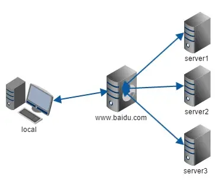

# 相关面试题目：跨域

## 跨域

同源策略：协议 域名 端口。

浏览器跨域限制是出于安全性考虑，同源策略的实施可以防止恶意脚本通过跨域请求获取敏感数据。

拿当前HTML页面的地址和在页面中AJAX请求的API地址做比较：
>如果两个地址的协议域名端口号都相同，相当于HTML页面从同一个源下根据某个地址获取数据，属于“同源策略请求”，基于AJAX是可以直接请求到数据的！
>如果三者（协议域名端口号）只要有一个不一样，那么就是“非同源策略请求（跨域请求）”，使用AJAX不能直接获取数据了

同源：  
HTML页面的地址：http://localhost:8000/A.html  
AJAX请求的地址：http://localhost:8000/queryInfo  

非同源：  
HTML页面的地址：http://localhost:8000/201802LESSON/static/A.html  
AJAX请求的地址：http://localhost:8080/queryInfo  

报错：
> Failed to load http://localhost:8000/queryInfo: No 'Access-Control-Allow-Origin' header is present on the requested resource. Origin 'http://localhost:63342' is therefore not allowed access.

其他类似问题：

- cookie、LocalStorage
- DOM元素也有同源策略 iframe
- ajax 也不支持跨域

跨域的普遍性？
> 现在的项目一般都是前后端分离的，大部分公司都会把后台的程序用一个新的服务管理，把客户端程序也用一个新的服务管理，两个服务不是同一个源；这样就导致客户端是向其他源发送AJAX请求，跨域成为请求的阻碍问题；
>
> 同源：把客户端程序和服务器程序在一个服务中发布

### JSONP

- 只能发送get请求
- 不安全 xss（Cross Site Scripting）攻击

在客户端ajax不允许直接的跨域请求，但是很多东西都可以直接的跨域，例如 script、img、ifram、link等（这些标签的SRC或者HREF设置任何一个资源请求地址，哪怕是其它源下的，也都没有跨域的限制，直接可以把内容获取到[除非服务器做特殊处理了]）针对这个特点，真实项目中某些JS文件加载的都是CDN地址

JSONP可以实现跨域：利用script标签不存在跨域限制来实现，需要客户端和服务端双方面支持配合才可以完成

客户端：

- 准备一个全局函数（不能是私有的）
- 创建一个script标签，把需要请求的地址放到SRC属性上，通过问号传参的方式，把全局函数传递给服务器

服务端：

- 接受客户端请求的信息（script src的请求都是GET请求）
- 获取问号传参的内容，也就是callback后面传递的函数名（当然callback可以和客户端协商好）
- 把函数名和需要返回给客户端的数据拼成字符串：“函数名（数据）”的格式，并且返回给客户端

JSONP只支持GET请求，其它请求都无法实现，所以真是项目中只把：从服务器获取信息的需求，可能采用JSONP跨域的方式来处理，对于POST等其它方式需要另用它法

后端实现：

```javascript
    const Koa = require("koa");
    const fs = require("fs");
    const app = new Koa();

    app.use(async (ctx, next) => {
    if (ctx.path === "/api/jsonp") {
        const { cb, msg } = ctx.query;
        ctx.body = `${cb}(${JSON.stringify({ msg })})`;
        return;
    }
    });

    app.listen(8080);
```

前端实现：

```html
    <script type="text/javascript">
        window.jsonpCallback = function(res) {
            console.log(res);
        };
    </script>
    <script src="http://localhost:8080/api/jsonp?msg=hello&cb=jsonpCallback" type="text/javascript"></script>
```

JQuery Ajax：

```html
    <script src="https://cdn.bootcss.com/jquery/3.5.0/jquery.min.js"></script>
    <script>
        $.ajax({
            url: "http://localhost:8080/api/jsonp",
            dataType: "jsonp",
            type: "get",
            data: {
            msg: "hello"
            },
            jsonp: "cb",
            success: function(data) {
            console.log(data);
            }
        });
    </script>
```

原理解析：

我们先看一下最简单的JS调用：

```html
    <script>
        window.jsonpCallback = function(res) {
            console.log(res);
        };
    </script>
    <script>
        jsonpCallback({ a: 1 });
    </script>
```

我们稍微改造一下：

```html
    <script>
        window.jsonpCallback = function(res) {
            console.log(res);
        };
    </script>
    <script src="http://localhost:8080/api/a.js"></script>

    <!-- http://localhost:8080/api/a.js jsonpCallback({a:1}); -->
```

我们再改造一下，我们把这个外链的 js 就当做是一个动态的接口，因为本身资源和接口一样，是一个请求，也包含各种参数，也可以动态化返回

```html
<script>
    window.jsonpCallback = function(res) {
        console.log(res);
    };
    </script>
    <script src="http://localhost:8080/api/a.js?a=123&cb=jsonpCallback"></script>

    <!-- http://localhost:8080/api/a.js jsonpCallback({a:123}); -->
```

### CORS

跨域资源共享（CORS）是一种机制，它使用额外的HTTP请求头来告诉浏览器 让运行在一个 origin（domain） 上的Web应用被准许访问来自不同服务器上的指定的资源。而在CORS中会有简单请求和复杂请求的概念。

简单请求：不会触发CORS预检请求。注意该术语并不属于Fetch（其中定义了CORS）规范。

1. 使用以下方法：GET、POST、HEAD
2. 人为设置以下集合外的请求头：
   1. Accept
   2. Accept-Language
   3. Content-Language
   4. Content-Type
   5. DPR
   6. Downlink
   7. Save-Data
   8. Viewport-Width
   9. Width
3. Content-Type 的值仅限以下三者之一
   1. text/plain
   2. multipart/form-data
   3. application/x-www-form-urlencoded
4. 请求中的任意 XMLHttpRequestUpload 对象均没有注册任何事件监听器；XMLHttpRequestUpload 对象可以使用 XMLHttpRequest.upload 访问
5. 请求中没有使用 ReadableStream 对象

非简单请求：除以上外的所有情况

主要是服务器设置：配置允许跨域的相关头部信息（Node中CORS的解决代码）

```javascript
    app.use((req, res, next) => {
        //=>允许哪些源可以向这个服务发送AJAX请求（通配符是允许所有的源，也可以单独设置某个源 "http://localhost:8000/"这样就是只允许8000服务过来请求） =>不使用通配符是为了保证接口和数据的安全，不能让所有的源都能访问；而且一旦设置了允许携带凭证过来，则设置*会被报错，此时只能设置具体的源！只能设置单一一个允许访问的源！
        res.header("Access-Control-Allow-Origin", "http://localhost:8000");
        //=>是否允许跨域的时候携带凭证（例如：COOKIE就是凭证的一种，设置为FALSE，客户端和服务器之间不会传递COOKIE，这样SESSION存储就实效了）
        res.header("Access-Control-Allow-Credentials", true);
        //=>允许的请求头部
        res.header("Access-Control-Allow-Headers", "Content-Type,Content-Length,Authorization, Accept,X-Requested-With");
        //=>允许的请求方式（OPTIONS一定要有）
        res.header("Access-Control-Allow-Methods", "PUT,POST,GET,DELETE,HEAD,OPTIONS");
        //=>设置OPTIONS请求目的：我们把这个请求当做一个试探性请求，当客户端需要向服务器发送请求的时候，首先发送一个OPTIONS请求，服务器接收到是OPTIONS请求后，看一下是否允许跨域，允许返回成功，如果服务器不允许跨域，则客户端会出现跨域请求不允许的错误；如果客户端检测到不允许跨域，则后续的请求都不在进行!  =>客户端AXIOS框架就是这样处理的
        if (req.method === 'OPTIONS') {
            res.send('OK!');
            return;
        }
        next();
    });
```

客户端：

```javascript
    axios.defaults.withCredentials = true;
    //=>var xhr = new XMLHttpRequest();
    //=>xhr.withCredentials=true

    //axios在某些特定场景下，在发送真实请求之前都会发送一个预请求（OPTIONS）格式的，来验证是否允许跨域
```

CORS的COOKIE问题：想要传递COOKIE需要满足3个条件

1. web请求设置withCredentials
   > 默认情况下在跨域请求，浏览器是不带 cookie 的,我们可以通过设置withCredentials来进行传递cookie
2. Access-Control-Allow-Credentials 为 true
3. Access-Control-Allow-Origin 为非 *

弊端：只能指定一个允许源（不能用通配符和指定多个源），所以目前真实项目中基于CORS实现跨域资源共享是主流方案

### webpack proxy（常用）

浏览器发送请求到非同源服务器，会导致跨域问题，而服务器与服务器之间的通信（不依赖浏览器）是不存在跨域问题的

- 安装webpack-dev-server
- 配置代理：

```javascript
proxy: {
    //捕获api的标志
    '/api': {
        //代理的api地址
        target: 'https://other-server.example.com',
        //target是否可以是域名
        changeOrigin: true,
        //不检查安全问题
        secure: false,
        //路径重写
        pathRewrite: {
            '^/api' : ''
        }
    },
    '/getInfo':{
        target: 'https://other-server.example.com',
        changeOrigin: true
    }
}
```

### nginx反向代理

更改nginx配置文件 conf/nginx.conf

```json
    server {
        listen 80;
        server_name local.test;
        location /api {
            proxy_pass http://localhost:8080;
        }
        location / {
            proxy_pass http://localhost:8000;
        }
    }
```

### 基于IFRAME实现跨域（4）

iframe可以实现父页面嵌入子页面(父页面中可以基于js获取子页面中的内容)

1. window.name：name是window天生自带的属性，而且有一个特点，同源下，早X页面中设置name的值，页面关掉或者刷新，上次设置的值不消失，能够一直存储最后一次修改的值信息
2. document.domain：只能处理主域相同，但是子域不同的情况：v.qq.com 和 s.qq.com
3. window.location.hash：原理就是通过 url 带 hash ，通过一个非跨域的中间页面来传递数据
4. window.postMessage：提供了一种受控机制来规避同源限制

### 正向代理和反向代理

#### 正向代理

我们常说的代理指的是正向代理，举个不是很恰当的例子，A创业需要大量资金，但是由于A自己本身的资质无法从银行等金融机构贷出需要的数量，于是A托B去C（人或者机构）贷款或者借钱，不过C并不知道钱最后是给A的，这里B在这个事件中扮演了代理的角色，这就是正向代理。

正向代理的过程，隐藏了真是的请求客户，服务端并不知道真是的客户是谁，客户端请求的服务都被代理服务器代替来请求，某些科学上网工具扮演的就是典型的正向代理角色。


正向代理代理的是客户端

#### 反向代理

大家可能都有过这样的经理，拨打客户电话的时候，可能一个地区的客户有几个或者几十个，你永远都不需要关心在电话对面的是哪一个，叫什么，你都不关心，你关心的是你的问题能否得到专业的解答，所以你知道拨打客服的总机号码，电话对面总有人会回答你，只是有时候快有时候慢。那么这里的总机号码就是我们说的反向代理。客户并不知道真正提供服务的人是谁。

反向代理隐藏了真正的服务端，当我们请求 /www.baidu.com 的时候，背后可能有成千上万台服务器为我们服务，但是具体哪一台，你不知道，你只需要知道反向代理服务器是谁就可以了，反向代理服务器会帮我们把请求转发到真是的服务器里。Nginx就是性能非常好的反向代理服务器，用来做负载均衡。



反向代理代理的是服务端
