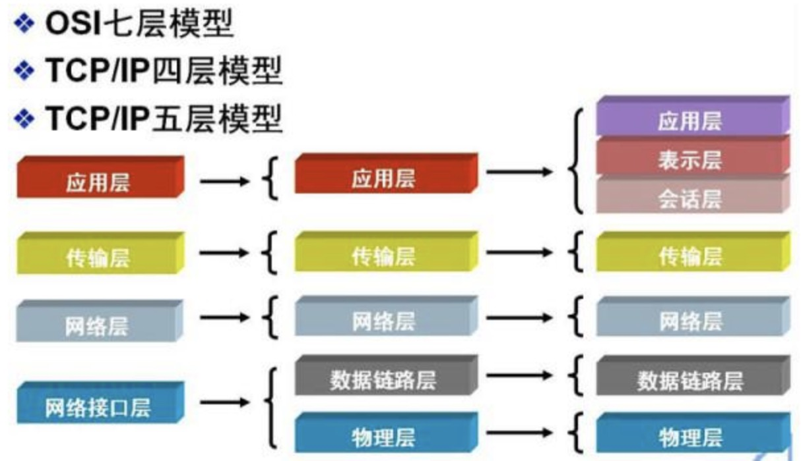
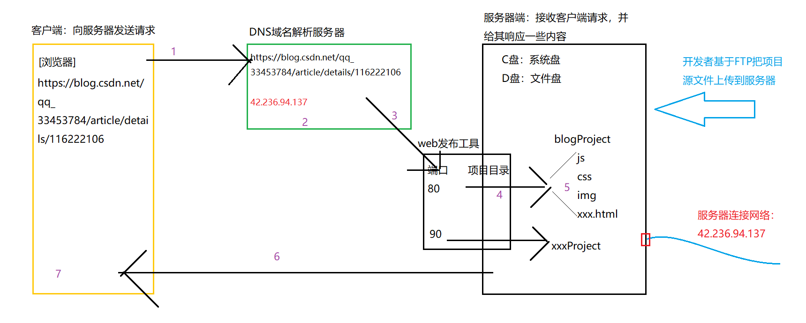

# 1.0 键入网址到网页显示，期间发生了什么？

## URL解析  

> 首先浏览器做的第一步工作就是要对 URL 进行解析，从而生成发送给 Web 服务器的请求信息。

<https://www.baidu.com/>  
<https://item.jd.com/100038005193.html>  
<https://detail.tmall.com/item.htm?de_count=1&id=709064714885&skuId=5148947539712>

一个完整的 URL 分为几个部分

- 协议
  - `HTTP(80)`：超文本传输协议
  - `HTTPS(443)`：基于SSL（Secure Sockets Layer 安全套接层）加密的HTTP传输协议，比HTTP更加安全（涉及支付的网站一般都是基于HTTPS完成的）
  - `FTP(21)`：文件传输协议，一般用来实现资源文件在服务器上的上传下载
- 域名(服务器)
- 端口
  - 用来区分同一台服务器上不同服务的标识（基于WEB服务管理器创建服务的时候可以指定）不同服务之间一般是不能使用相同的端口号的
  - ​如果当前网站服务，采用的是协议对应的默认端口管理，那么当用户输入网址的时候可以不指定端口号，浏览器会默认把用户把默认的端口传递给服务器
  - 一台服务器上的端口号范围：0~65535之间，1023及以下的端口已经分配给了常用的一些应用程序做保留
- 路径
  - `/stu/index.html`：一般都是请求当前服务对应的项目目录中，STU文件夹中的INDEX.HTML页面。但是也有特情况，就是当前的URL是被“伪URL重写”的，我们看到的URL请求其实不是真实的请求（例如 `https://item.jd.com/4679424.html` 这个URL就是被重写的，它的真实URL地址很可能是 `https://item.jd.com/detail.jsp?id=4679424`，其实就是跳转到详情页，通过问号传递不同的产品编号，展示不同的产品详情信息，但是.jsp这种服务器渲染的动态页面不能被搜索引擎收录，不利于页面的SEO，所以我们会把动态页面静态化，这也就用到了URL重写技术）
  - `/stu/info`：这种没有任何后缀信息，一般都不是用来请求资源文件的，而是用于AJAX数据请求的接口地址（如果后缀是.json类的，也是同理），但是有一种除外 /stu/info/ 这种的很可能不是接口地址，而是没有指定请求的资源名称，服务器会请求默认的资源文件，一般都是index.html/default.html...
  - `DHTML`：动态页面，泛指当前页面中的内容不是写死的而是动态绑定的，例如.jsp/.php/.aspx...这些页面中的数据都是基于AJAX或者是后台编程语言处理，由服务器端渲染，最后把渲染后的结果返回给客户端呈现的
- 参数
  - 问号传参及哈希值`[?xxx=xxx&...\#xxx]` `[?name=xxx&age=25#teacher]`
  - 在HTTP事务中，问号传参是客户端把信息传递给服务器的一种方式(也有可能是跳转到某一个页面，把参数值传递给页面用来标识的)
  - 哈希值一般都跟客户端服务器交互没啥关系，主要用于页面中的锚点定位和HASH路由切换

## HTTP请求阶段：向服务器发送请求

### DNS域名解析

> 通过浏览器解析 URL 并生成 HTTP 消息后，需要将消息发送给 Web 服务器。

但在发送之前，还有一项工作需要完成，那就是查询服务器域名对应的 IP 地址

有一种服务器就专门保存了 Web 服务器域名与 IP 的对应关系，它就是 DNS 服务器

> 域名的层级关系  

DNS 中的域名都是用句点来分隔的，比如`www.baidu.com`这里的句点代表了不同层次之间的界限。

在域名中，越靠右的位置表示其层级越高。实际上域名最后还有一个点，比如`www.baidu.com.`
这个最后的一个点代表根域名。

根域的 DNS 服务器信息保存在互联网中所有的 DNS 服务器中

也就是，. 根域是在最顶层，它的下一层就是 .com 顶级域，再下面是 baidu.com。

所以域名的层级关系类似一个树状结构：

> 域名解析的工作流程  

- 缓存查询(浏览器缓存、操作系统缓存、hosts文件、路由器DNS缓存)
- 本地DNS服务器（也就是客户端的 TCP/IP 设置中填写的 DNS 服务器地址）
- 当本地DNS服务器接到客户端请求时，首先在该服务器管理的区域的记录中查找，如果找到该记录，则利用此记录进行解析；如果没有区域信息可以满足查询要求，服务器在本地的缓存中查找
- 如果本地DNS服务器不能在本地找到客户端查询的信息，本地DNS服务器将请求发送到根域名DNS服务器(根域名服务器是最高层次的，它不直接用于域名解析)
- 根域名服务器负责解析客户端请求的根域部分，它将包含下一级域名信息的DNS服务器地址返回给客户端的DNS服务器
- 客户端的DNS服务器利用根域名服务器返回的地址访问下一级DNS服务器，得到再下一级域的DNS服务器
- 按照上述递归方法逐级接近查询目标，最后在有目标域名的DNS服务器上找到相应IP地址信息
- 客户端的本地DNS服务器将递归查询结果返回客户端
- 客户端利用从本地DNS服务器查询得到的IP访问目标主机，客户端和目标建立链接（首先访问的是服务器的web站点管理工具：准确来说是我们先基于工具在服务器上创建很多服务，当有客户端访问的时候，服务器会匹配出具体是请求哪个服务）
- 通过URL地址中携带的端口号，找到服务器上对应的服务，以及服务所管理的项目源文件

### 协议栈(网络模型)  

> 通过DNS解析获取到IP后,就可以把传输工作交给系统中的协议栈

协议栈分为几个部分,我们要在这提一下网络模型

我们以TCP/IP五层模型为例来看一下各个部分的内容

#### 应用层  

我们能直接接触到的就是应用层,当两个不同设备的应用需要通信的时候,应用就把应用数据传给下一层,也就是传输层

应用层是工作在操作系统中的 ***用户态***  传输层及以下则工作在 ***内核态***  

> 应用层协议：TFTP，FTP，HTTP，SNMP，SMTP，DNS，RIP，Telnet  

#### 传输层  

应用层的数据包会传输给传输层,传输层为应用层提供网络支持,提供端对端的接口

> 传输层协议：TCP，UDP  
>
> TCP：传输控制协议Transmission Control Protocol,大部分应用使用的正是TCP传输协议,比如HTTP应用层协议.TCP相比UDP多了很多特性,比如流量控制、超时重传、拥塞控制,这些都是为了保证数据包能可靠的传送给对方。
>
> UDP：UDP相对来说就简单很多,简单到只负责发送数据包,不保证数据包能否抵达对方,但它实时性相对更好,传输效率也高.当然UDP也可以实现可靠传输,把TCP的特性在应用层上实现就可以。
>
> 应用需要传输的数据可能很大,如果直接传输就不好控制,因此当传输层的数据包大小超过MSS(TCP最大报文段长度),就要将数据包分块,这样即使中途有一个包丢失或损坏了,只需要重发这一个分块.在TCP协议中,我们把每个分块成为一个`TCP段`。  
>
> 当设备作为接收方时，传输层则要负责把数据包传给应用，但是一台设备上可能会有很多应用在接收或者传输数据，因此需要用一个编号将应用区分开来，这个编号就是端口。
>
> 比如 80 端口通常是 Web 服务器用的，22 端口通常是远程登录服务器用的。而对于浏览器（客户端）中的每个标签栏都是一个独立的进程，操作系统会为这些进程分配临时的端口号。
>
> 由于传输层的报文中会携带端口号，因此接收方可以识别出该报文是发送给哪个应用。

#### 网络层:为数据包选择路由  

> 网络层协议：IP，IPv6，SLIP，ICMP，IGMP，ARP，RARP

传输层可能大家刚接触的时候，会认为它负责将数据从一个设备传输到另一个设备，事实上它并不负责。

实际场景中的网络环节是错综复杂的，中间有各种各样的线路和分叉路口，如果一个设备的数据要传输给另一个设备，就需要在各种各样的路径和节点进行选择，而传输层的设计理念是简单、高效、专注，如果传输层还负责这一块功能就有点违背设计原则了。

也就是说，我们不希望传输层协议处理太多的事情，只需要服务好应用即可，让其作为应用间数据传输的媒介，帮助实现应用到应用的通信，而实际的传输功能就交给下一层，也就是网络层（Internet Layer）。

## HTTP响应阶段：服务器把客户端需要的内容准备好，并且返回给客户端  

- 服务器根据请求地址中的路劲名称、问号传参或者哈希值，把客户端需要的内容进行准备和处理
- 把准备的内容响应给客户端~~（如果请求的是HTML或者CSS等这样的资源，服务器返回的是资源文件中的代码，不是文件本身）~~

## 浏览器渲染阶段：客户端浏览器接受到服务器返回的源代码，基于自己内部的渲染引擎（内核）开始进行页面的绘制和渲染

- 首先计算DOM结构，生成DOM TREE
- 自上而下运行代码，加载CSS等资源内容
- 根据获取的CSS生成带样式的RENDER TREE
- 开始渲染和绘制

我们把一次完整的请求+响应 称之为`HTTP事务`

一个页面完全加载完成，需要向服务器发起很多次的`HTTP事务`操作

- 一般来说：首先把HTML源代码拿回来，加载HTML的时候遇到link/script/img[src]/iframe/video/audio[没有设置preload='none']...都会重新和服务器端建立HTTP事务交互
- 特殊情况：如果我们做了资源缓存处理（304）而且即将加载的资源在之前已经加在过了，这样的操作和传统的HTTP事务有所不同，他们是从服务器和浏览器的缓存中读取数据，比传统的快很多

在客户端向服务器发送请求，以及服务器把内容响应给客户端的时候，中间相互传递了很多内容（客户端把一些内容传递服务器，服务器把一些内容响应给客户端）我们把传递的内容统称为`HTTP报文`
