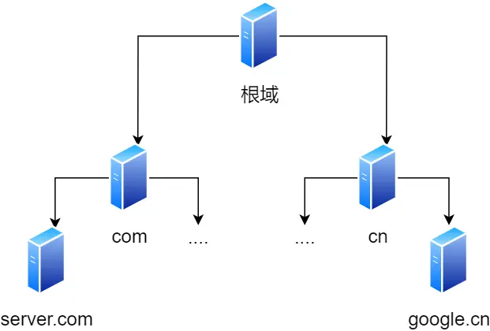

# 1.0 键入网址到网页显示，期间发生了什么？ 

## URL解析  

> 首先浏览器做的第一步工作就是要对 `URL` 进行解析，从而生成发送给 `Web` 服务器的请求信息。

<https://www.baidu.com/>  
<https://item.jd.com/100038005193.html>  
<https://detail.tmall.com/item.htm?de_count=1&id=709064714885&skuId=5148947539712> 

一个完整的`URL`分为几个部分

- 协议   
- 域名(服务器)
- 端口
- 参数(路径名)

## DNS域名解析

> 通过浏览器解析 `URL` 并生成 HTTP 消息后，需要将消息发送给 Web 服务器。

有一种服务器就专门保存了 Web 服务器域名与 IP 的对应关系，它就是 DNS 服务器

> 域名的层级关系  

DNS 中的域名都是用句点来分隔的，比如 www.baidu.com，这里的句点代表了不同层次之间的界限。

在域名中，越靠右的位置表示其层级越高。

实际上域名最后还有一个点，比如 www.baidu.com.，这个最后的一个点代表根域名。

也就是，. 根域是在最顶层，它的下一层就是 .com 顶级域，再下面是 baidu.com。

所以域名的层级关系类似一个树状结构：

> 域名解析的工作流程  

